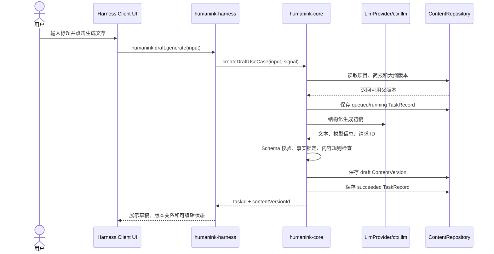
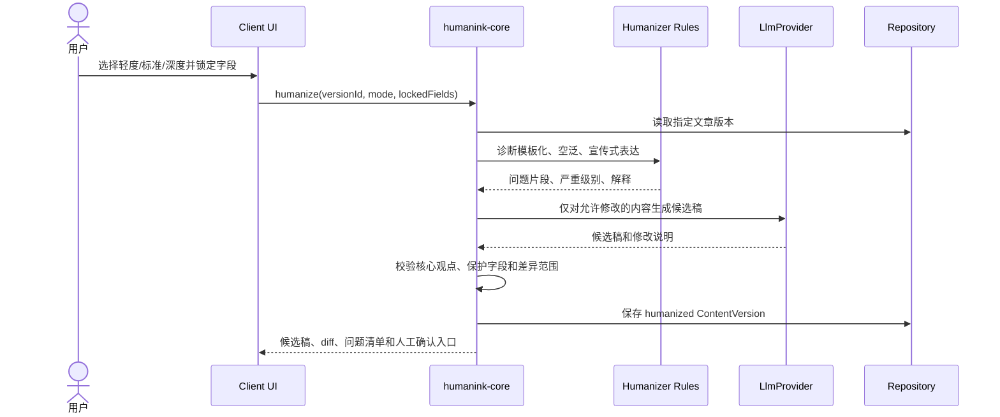
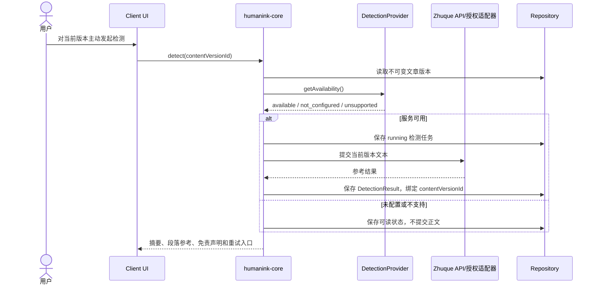

# HumanInk 技术栈与系统架构参考文档

- **产品名称**：HumanInk
- **产品形态**：DeepSeek Harness 插件
- **文档版本**：0.1.0
- **文档状态**：架构基线，供 MVP 实现评审与拆分任务使用
- **编写日期**：2026-08-31
- **适用范围**：通用中文内容工作台，不绑定微信公众号、小红书、抖音或其他单一发布平台
- **关联产品文档**：[`docs/superpowers/specs/2026-08-31-humanink-mvp-design.md`](../superpowers/specs/2026-08-31-humanink-mvp-design.md)

## 1. 架构结论

HumanInk 采用“**Harness 适配层 + 独立内容领域核心 + 可替换 Provider + 版本化存储**”的分层架构：

```text
┌───────────────────────────────────────────────────────────┐
│                    DeepSeek Harness 宿主                  │
│  命令/工具注册 · LLM 服务 · Storage · Credentials · Client UI │
└───────────────────────────┬───────────────────────────────┘
                            │ apply(ctx) / 服务注入
┌───────────────────────────▼───────────────────────────────┐
│                 humanink-harness 适配层                    │
│  插件入口 · 命令与工具 · Client UI Slot · 任务生命周期 · 映射 │
└───────────────────────────┬───────────────────────────────┘
                            │ 只传递结构化输入/输出
┌───────────────────────────▼───────────────────────────────┐
│                    humanink-core 领域核心                 │
│  项目 · 创作者档案 · 选题 · 标题 · 简报 · 大纲 · 初稿       │
│  人味化 · 复核 · 检测编排 · 版本 · 导出 · 规则与不变量       │
└───────────────┬───────────────────┬───────────────────────┘
                │                   │
┌───────────────▼────────────┐ ┌────▼──────────────────────┐
│ Provider 接口               │ │ Repository 接口           │
│ LLM · Detection · (P1 搜索) │ │ Harness Storage / JSONL   │
└───────────────┬────────────┘ └────┬──────────────────────┘
                │                   │
┌───────────────▼────────────┐ ┌────▼──────────────────────┐
│ Harness LLM                 │ │ 生产存储 / 本地开发存储    │
│ Zhuque Detection（可选）    │ │ 版本文件与任务状态          │
└────────────────────────────┘ └───────────────────────────┘
```

### 1.1 一句话原则

> Harness 负责运行时集成，Core 负责产品规则，Provider 负责外部能力，Repository 负责可恢复的数据；任何一层都不越界替代另一层。

### 1.2 MVP 只保证一条稳定闭环

```text
想法/标题
  → 选题角度
  → 标题候选
  → 内容简报
  → 大纲
  → 文章初稿
  → 中文人味化
  → 发布前质量检查
  → 朱雀 AI 检测参考
  → 版本化导出
```

搜图、AI 封面、实时热点、多平台改写和自动发布均通过后续 Provider 或工作流扩展，不反向污染 MVP 核心。

## 2. 架构目标与边界

### 2.1 目标

1. **稳定交付**：模型、检测服务或 Harness UI 发生变化时，中文内容核心仍可单独测试和演进。
2. **可追溯**：原文、初稿、改写稿、复核结果、检测结果和导出物都能关联到具体文章版本。
3. **可恢复**：外部服务失败、超时、取消或进程重启不能覆盖用户原文，也不能把半成品标记为最终稿。
4. **可替换**：首期使用 Harness 的 LLM 和 Storage；本地可用 Fake/JSONL 适配器，未来可替换模型、数据库、搜索和图片服务。
5. **可解释**：人味化输出修改原因；复核输出问题、证据状态和建议；朱雀输出只作为外部参考，不作为“真人认证”。
6. **低耦合**：命令能力、正式 Harness Client UI 和 Core 可以分别开发、测试和发布。

### 2.2 明确不做

- 不把 HumanInk 做成某一个平台的发布器；
- 不以降低任何 AI 检测分数为唯一优化目标；
- 不自动循环改写，直到某个检测结果达到目标分数；
- 不虚构个人经历、数据、案例、引用或来源；
- 不在 Core 内直接调用 HTTP、浏览器 DOM 或 Harness UI 内部实现；
- 不把朱雀网页当作稳定 API 使用，不绕过验证码、登录限制或站点规则；
- 不在 MVP 引入需要本机原生编译的数据库依赖；
- 不用一次模型调用生成不可编辑、不可回退的黑盒最终稿。

## 3. 技术栈选型

### 3.1 选型表

| 层次 | 选定技术 | 版本策略 | 选择理由 | 替代方案与暂缓原因 |
|---|---|---|---|---|
| 主语言 | TypeScript | 5.x，使用锁文件固定实际小版本 | 适合 Harness 插件、领域类型、结构化模型输出和前后端共享类型 | JavaScript 类型约束不足；Python 不作为 Harness 插件主运行时 |
| 运行时 | Node.js | 22.19+ 为最低基线，CI 验证 Node 22.x 与 24.x；最终服从 Harness 包的 `engines` 约束 | 与现代 ESM、原生 `fetch`、`AbortController` 和 Harness 生态兼容 | Node 20 不作为新项目基线；Deno/Bun 暂不作为宿主运行时 |
| 模块系统 | ESM | `package.json` 使用 `type: module`，TypeScript 使用 NodeNext | 与现代 Node 包和 Harness 官方包的导入方式一致 | CommonJS 仅允许作为兼容构建产物，不作为源码规范 |
| 包管理 | pnpm workspace | pnpm 11.x，通过 `packageManager` 字段和 CI 固定 | 安装速度快、依赖去重好，适合 Core、Adapter、Client 多包结构 | npm 可用于使用者安装；不作为仓库内部的主包管理器 |
| Harness 集成 | `@deepseek-ai/cordis` 与官方 `@deepseek-ai/dsh-*` 包 | 跟随 Harness 官方模板与锁文件 | 使用官方 `apply(ctx)`、服务注入和宿主能力，不复制宿主实现 | 自建插件运行时会增加兼容和发布成本 |
| 领域核心 | 独立 `humanink-core` TypeScript 包 | 不导入任何 Harness 包 | 可以脱离宿主做单元测试、CLI 冒烟和未来 Web/API 复用 | 直接把业务写在 `apply(ctx)` 中会导致不可测、不可迁移 |
| 边界校验 | Zod | 4.x 或项目锁定的兼容小版本，仅在输入/输出边界使用 | 校验用户输入、模型 JSON、Provider 返回值，避免错误数据进入版本库 | 只依赖 TypeScript 类型无法防御运行时数据；Harness Schema 只用于宿主边界 |
| LLM | Core 定义 `LlmProvider`，Adapter 映射 `ctx.llm` | 不在 Core 固定具体模型 | 支持模型切换、Mock、自定义提示词版本和失败降级 | 在 Core 直接调用 DeepSeek SDK 会锁死供应商边界 |
| 持久化 | 生产使用 Harness Storage Adapter；本地使用 JSON/JSONL Adapter | Adapter 可替换，数据模型保持一致 | MVP 无原生数据库安装负担，版本记录适合追加写入 | SQLite/PostgreSQL 在多用户、查询和并发需求明确后再引入 |
| 前端 | 命令与 `dsh web` UI 共用文字流程；Client 使用 React + 官方 Slot/Primitive | 当前不交付独立产品演示页 | 命令路径便于自动化验收；React 适合复杂编辑器和异步状态 | Tailwind 暂不使用，避免与 Harness 宿主样式冲突 |
| Markdown/HTML 导出 | Markdown 为规范源格式；HTML 使用受控 Markdown Renderer 并做清理 | 导出器独立于 Core 编排 | 便于版本 diff、复制和跨平台迁移 | 直接拼接原始 HTML 有 XSS 风险；富文本编辑器后置 |
| 测试 | Vitest + jsdom + Playwright | PR 至少 Core、Adapter、静态检查；发布前加浏览器验收 | 覆盖同步规则、异步任务、Client UI 和响应式行为 | Jest 可行但不优先；只做手工点击不满足交付要求 |
| 类型/质量 | `tsc --noEmit`、oxlint、`git diff --check` | 每次提交前执行 | 分别覆盖类型、静态质量和补丁空白错误 | 只依赖 IDE 检查无法形成可复现门禁 |
| 构建 | TypeScript project references + tsdown | 输出 ESM、类型声明和 Harness 可加载入口 | 适合多包构建和清晰的发布物 | 直接以 ts-node 运行不适合交付 |

> 版本号是工程基线，不等于永远锁死。实现阶段必须以 Harness 官方模板、包的 `engines` 和实际发布版本再次校准，并把结果写入 `package.json`、锁文件和 CI 配置。

### 3.2 为什么不先上数据库

MVP 的主要数据是内容版本和任务记录，写入频率低于高并发业务系统，最关键的要求是“原文不丢、派生可追踪、能够导出”。因此首期采用 Repository 接口隔离：

- 本地开发：按项目拆分的 JSON/JSONL 文件，写入采用临时文件 + 原子替换；
- Harness 运行：优先映射到宿主 Storage；
- 后续团队协作或云端部署：新增 SQLite/PostgreSQL Adapter，不改变 Core 的用例和领域类型。

不引入数据库并不意味着放弃数据约束。Repository 必须检查 ID 唯一性、父版本存在性、版本归属一致性和并发写冲突。

## 4. 逻辑架构与模块职责

### 4.1 `humanink-core` 领域模块

```text
humanink-core/
├─ src/
│  ├─ domain/
│  │  ├─ project/       # 内容项目、状态和工作流不变量
│  │  ├─ creator/       # 创作者档案、语气偏好、保护字段
│  │  ├─ topic/         # 选题角度和简报
│  │  ├─ title/         # 标题候选、理由和风险提示
│  │  ├─ article/       # 大纲、正文、文章块和来源引用
│  │  ├─ humanize/      # 中文模板化诊断、人味化策略、差异说明
│  │  ├─ review/        # 事实、结构、表达、合规和发布前检查
│  │  ├─ detection/     # 外部检测任务和参考结果
│  │  ├─ versioning/    # 不可变版本、血缘、恢复和 diff
│  │  └─ export/        # Markdown、HTML、TXT 导出
│  ├─ application/      # 用例编排，不依赖 Harness
│  ├─ ports/            # LlmProvider、Repository、DetectionProvider
│  ├─ prompts/          # 有版本的提示词模板和输出约束
│  └─ shared/           # ID、时间、错误、Result、日志字段
└─ tests/
   ├─ domain/
   ├─ application/
   └─ contracts/
```

Core 每个用例只接收显式输入、显式依赖和 `AbortSignal`，不得从全局变量读取宿主状态。其输出必须是结构化结果，而不是依赖 UI 的字符串拼接。

### 4.2 `humanink-harness` 适配层

```text
humanink-harness/
├─ src/
│  ├─ index.ts          # apply(ctx) 插件入口
│  ├─ services/
│  │  ├─ llm-provider.ts
│  │  ├─ storage-repository.ts
│  │  ├─ credentials.ts
│  │  └─ task-runtime.ts
│  ├─ commands/         # 对外暴露的命令/工具薄适配器
│  ├─ client/            # Slot/Primitive 注册与事件映射
│  └─ mapping/           # Harness 数据与 Core DTO 的转换
└─ tests/
   ├─ plugin-entry.test.ts
   ├─ provider-contracts.test.ts
   └─ commands.test.ts
```

适配层只负责四类事情：

1. 从 Harness 读取服务并构造 Core 依赖；
2. 将命令、工具调用或 Client UI 事件转换为 Core 用例输入；
3. 将 Core 的结构化结果映射为宿主可展示的结果、状态和错误；
4. 管理任务取消、进度、通知和宿主生命周期。

适配层不实现标题算法、人味化规则、文章版本规则和检测结论。

### 4.3 `humanink-client` 正式 UI 边界

- 当前 MVP 不保留独立产品演示页，交付重点是可测试的 Harness 命令和内容版本链；
- `humanink-client` 使用 React，通过 Host facade 和 Connection RPC 访问内容能力；
- 正式 UI 通过 Adapter 提供的 DTO 和事件协议工作，不直接读写 Repository；
- 所有生成按钮都显示当前项目、当前文章版本、执行状态和取消入口；
- UI 必须支持“查看原稿、查看派生稿、查看修改说明、恢复到旧版本”，而不是只显示最后一次模型输出。

## 5. Harness 插件边界

### 5.1 入口与服务注入

插件入口采用 Harness 的 `apply(ctx)` 约定。运行时依赖通过 Harness 的服务注入机制取得，建议注入：

- LLM 服务：用于结构化生成、改写和复核；
- Storage 服务：用于保存项目、版本、任务和配置引用；
- Credentials 服务：用于管理 DeepSeek、朱雀或未来 Provider 的凭据；
- Client UI 能力：用于 Slot/Primitive 注册、状态展示和交互；
- 日志/生命周期能力：用于任务取消、退出清理和结构化日志。

具体导入名和注入 token 必须以目标 Harness 版本的官方模板为准。业务代码只依赖 `humanink-core` 的端口类型，不把 `ctx` 传入 Core。

示意边界：

```ts
// humanink-harness/src/index.ts：仅为边界示意，实际 API 以 Harness 版本为准
export function apply(ctx: HarnessContext) {
  const llm = createHarnessLlmProvider(ctx);
  const repository = createHarnessRepository(ctx);
  const detection = createDetectionProvider(ctx);
  const service = createHumanInkApplication({ llm, repository, detection });

  registerCommands(ctx, service);
  registerClientSurface(ctx, service);
}
```

### 5.2 对外命令/工具建议

命令名需要稳定、面向内容任务，而不是暴露内部类名：

| 命令/工具 | 作用 | 是否创建新版本 |
|---|---|---:|
| `humanink.project.create` | 从想法、标题或原文创建内容项目 | 是 |
| `humanink.topic.suggest` | 基于输入和创作者档案给出选题角度 | 是，产出角度版本 |
| `humanink.title.generate` | 生成标题候选、策略和风险提示 | 是 |
| `humanink.brief.generate` | 生成内容简报和待确认问题 | 是 |
| `humanink.outline.generate` | 生成可编辑大纲 | 是 |
| `humanink.draft.generate` | 按简报和大纲生成初稿 | 是 |
| `humanink.humanize` | 诊断并生成中文人味化候选稿 | 是，保留父版本 |
| `humanink.review` | 执行发布前质量检查 | 是，结果关联当前版本 |
| `humanink.detect` | 主动提交外部检测并保存参考结果 | 是，结果关联当前版本 |
| `humanink.export` | 导出 Markdown、HTML 或 TXT | 否，生成导出物记录 |
| `humanink.version.restore` | 从历史版本创建一个新的恢复版本 | 是 |

长任务返回 `taskId`，不要让一次命令调用无限等待。UI 根据任务状态轮询或订阅进度，任务完成后再读取明确的 `contentVersionId`。

### 5.3 UI 约束

- 使用 Harness 官方 Client UI Slot/Primitive，避免覆盖宿主导航和全局样式；
- HumanInk 样式使用命名空间，例如 `.humanink-*`；
- 不依赖宿主页面的私有 DOM、CSS class 或 URL 结构；
- 重要操作提供键盘焦点、取消、错误重试和版本回退；
- 深色模式、窄屏布局、减少动效和长文本滚动属于验收范围；
- 正式 UI 的视觉原型可以先行，但不能把临时本地假数据协议当成正式 API。

## 6. Core Provider 接口

### 6.1 LLM Provider

Core 只关心内容任务，不关心模型服务来自 Harness、Mock 还是未来的远程 API。接口需要携带提示词版本和取消信号：

```ts
export interface LlmRequest {
  task: 'topic' | 'title' | 'brief' | 'outline' | 'draft' | 'humanize' | 'review';
  promptTemplateVersion: string;
  system: string;
  input: unknown;
  outputSchema: string;
  model?: string;
  temperature?: number;
  signal: AbortSignal;
}

export interface LlmResponse<T> {
  value: T;
  providerRequestId?: string;
  model?: string;
  usage?: { inputTokens?: number; outputTokens?: number };
}

export interface LlmProvider {
  generate<T>(request: LlmRequest): Promise<LlmResponse<T>>;
}
```

约束：

- 模型输出先解析、再用运行时 Schema 校验，校验失败不得写入“成功版本”；
- `system`、用户输入和外部素材必须分层标记，外部素材中的指令默认视为不可信内容；
- 记录模板版本、模型标识和请求 ID，不记录 API Key；
- 需要重试时复用同一个 `operationId`，避免把一次失败误计为多个用户操作。

### 6.2 Content Repository

```ts
export interface ContentRepository {
  createProject(input: CreateProjectInput): Promise<ContentProject>;
  getProject(projectId: string): Promise<ContentProject | null>;
  saveVersion(version: ContentVersion): Promise<void>;
  getVersion(versionId: string): Promise<ContentVersion | null>;
  listVersions(projectId: string): Promise<ContentVersionSummary[]>;
  saveTask(task: TaskRecord): Promise<void>;
  getTask(taskId: string): Promise<TaskRecord | null>;
}
```

实现要求：

- `saveVersion` 是追加或不可变写入，不能静默覆盖已有版本；
- 同一个 `versionId` 重复写入必须幂等，内容不一致则返回冲突；
- 保存派生结果前检查 `parentVersionId` 存在且属于同一项目；
- 写入成功后再把任务标记为 `succeeded`；
- 外部服务失败只保存失败任务和可读错误，不生成伪造正文。

### 6.3 Detection Provider

```ts
export interface DetectionRequest {
  projectId: string;
  contentVersionId: string;
  text: string;
  signal: AbortSignal;
}

export type DetectionAvailability =
  | 'available'
  | 'not_configured'
  | 'unsupported'
  | 'temporarily_unavailable';

export interface DetectionProvider {
  getAvailability(): Promise<DetectionAvailability>;
  detect(request: DetectionRequest): Promise<DetectionResult>;
}
```

`DetectionProvider` 的结果必须是“参考检测记录”，包含服务名称、提交时间、版本 ID、整体摘要、段落级信息（若服务提供）和免责声明。它不能向 Core 返回“真人/AI”的绝对结论，也不能触发自动循环改写或自动发布。

朱雀接入策略：

1. 首先确认官方或获得授权的接口、调用条款、认证方式和数据保留政策；
2. 有稳定授权 API 时，实现 `ZhuqueDetectionProvider`，将 HTTP、超时和响应映射封装在 Adapter 内；
3. 没有稳定授权 API 时，返回 `unsupported` 或提供用户主动录入的人工参考记录；
4. 不在 Core 中抓取网页、不模拟登录、不绕过验证，也不把网页 DOM 结构写成长期依赖。

### 6.4 P1 Provider 扩展点

MVP 先保留接口，不实现真实能力：

```ts
interface SearchProvider {
  search(request: SearchRequest): Promise<SearchResult>;
}

interface ImageSearchProvider {
  search(request: ImageSearchRequest): Promise<ImageCandidate[]>;
}

interface ImageGenerationProvider {
  generateCover(request: CoverRequest): Promise<GeneratedImageResult>;
}
```

图片结果必须带来源、作者、许可证或生成参数；搜索素材必须带来源 URL、抓取时间和证据摘要。这样可以避免以后把图片版权信息补进不可追踪的文章版本。

## 7. 内容版本与数据模型

### 7.1 版本不变量

1. 版本不可变；用户编辑或 AI 操作都创建新版本。
2. 所有派生版本包含 `parentVersionId`，能够沿父链回溯到原始输入。
3. 版本属于唯一 `projectId`，跨项目引用必须显式建立来源关系。
4. 检测结果只能绑定提交时的 `contentVersionId`，不能覆盖当前版本结果。
5. 恢复旧版本的动作是“以旧版本为内容创建新版本”，不是删除历史或改写历史。
6. `final` 是用户确认状态，不是模型自动授予的状态。
7. 保护字段（用户明确提供的事实、姓名、数字、引用、禁改段落）必须在改写前锁定并在结果中回显校验。

### 7.2 核心实体

```text
ContentProject
├─ id
├─ title
├─ status: active | archived
├─ creatorProfileId?
├─ currentVersionId?
├─ createdAt / updatedAt
└─ metadata

ContentVersion
├─ id
├─ projectId
├─ kind: source | topic | title | brief | outline | draft | humanized | review | restored
├─ parentVersionId?
├─ content: structured JSON + markdown
├─ protectedFields[]
├─ sourceRefs[]
├─ promptTemplateVersion?
├─ modelInfo?
├─ createdBy: user | llm | system
├─ userConfirmed: boolean
├─ createdAt
└─ contentHash

TaskRecord
├─ id / operationId
├─ projectId
├─ contentVersionId?
├─ type
├─ status: queued | running | succeeded | failed | timed_out | cancelled | interrupted
├─ attempt
├─ startedAt / finishedAt
├─ errorCode? / safeMessage?
└─ progress?

DetectionResult
├─ id
├─ projectId
├─ contentVersionId
├─ provider: zhuque | manual | other
├─ availability
├─ status: succeeded | failed | timed_out | cancelled
├─ summary?
├─ segmentFindings[]
├─ submittedAt / receivedAt
└─ disclaimer
```

### 7.3 规范化示例

```json
{
  "id": "version_01",
  "projectId": "project_01",
  "kind": "humanized",
  "parentVersionId": "version_00",
  "content": {
    "format": "markdown",
    "title": "一个普通标题",
    "body": "正文内容……"
  },
  "protectedFields": [
    { "type": "fact", "value": "2026 年 8 月", "locked": true }
  ],
  "sourceRefs": [],
  "promptTemplateVersion": "humanize.zh.v1",
  "modelInfo": { "provider": "harness", "model": "configured-by-user" },
  "createdBy": "llm",
  "userConfirmed": false,
  "createdAt": "2026-08-31T00:00:00.000Z",
  "contentHash": "sha256:..."
}
```

`contentHash` 用于检测重复写入和导出一致性；示例中的摘要值仅表示字段形状，实际实现必须保存真实摘要，不能使用占位值作为生产数据。

### 7.4 本地 JSONL 存储布局

```text
.humanink/
├─ projects.jsonl
├─ versions.jsonl
├─ tasks.jsonl
├─ detections.jsonl
├─ exports/
│  └─ <projectId>/<versionId>/
└─ settings.json
```

`.humanink/` 必须加入 `.gitignore`。默认不把正文、检测结果和凭据提交到代码仓库；项目备份通过显式导出完成。JSONL Adapter 写入前使用临时文件，写入后校验 JSON 可解析，再进行原子替换。

## 8. 三条关键时序

### 8.1 从标题生成文章



### 8.2 中文人味化



人味化规则参考 Humanizer-zh 的中文去模板化思路，但 HumanInk 的产品约束更严格：结果必须保留事实和用户意图，且不能宣称“规避检测”。

### 8.3 朱雀检测参考



## 9. 任务、错误、重试与降级

### 9.1 统一任务状态

所有可能超过一次 UI 交互周期的操作都使用 `TaskRecord`：

```text
queued → running → succeeded
                 ├→ failed
                 ├→ timed_out
                 ├→ cancelled
                 └→ interrupted
```

进程重启后，超过租约时间仍为 `running` 的任务标记为 `interrupted`，用户可以显式重试。重试不得覆盖原任务记录。

### 9.2 错误分类

| 错误码 | 典型原因 | 是否自动重试 | 用户可执行动作 |
|---|---|---:|---|
| `INPUT_INVALID` | 标题为空、版本不存在、锁定字段冲突 | 否 | 修正输入或选择正确版本 |
| `MODEL_OUTPUT_INVALID` | 模型返回非 JSON、缺字段或破坏事实 | 否，允许人工重新生成 | 查看原版本，调整输入后重试 |
| `LLM_TIMEOUT` | 模型响应超时 | 最多 2 次 | 继续等待或稍后重试 |
| `LLM_RATE_LIMITED` | 429 或配额限制 | 有退避地重试 | 等待、切换已配置模型 |
| `LLM_UNAVAILABLE` | 网络、5xx 或服务不可用 | 最多 2 次 | 保存现有内容，稍后重试 |
| `STORAGE_CONFLICT` | 同一版本 ID 内容不一致 | 否 | 刷新版本列表并选择新版本 |
| `DETECTION_NOT_CONFIGURED` | 未配置朱雀凭据或 Provider | 否 | 配置凭据或继续不检测 |
| `DETECTION_UNSUPPORTED` | 无授权 API 或当前环境不支持 | 否 | 使用人工参考记录 |
| `DETECTION_TIMEOUT` | 外部检测超时 | 最多 1 次 | 稍后重试，不影响文章 |
| `CANCELLED` | 用户主动取消 | 否 | 保留父版本，重新发起任务 |
| `SENSITIVE_CONTENT_BLOCKED` | 外部提交前触发隐私策略 | 否 | 脱敏后再确认提交 |

### 9.3 重试和超时策略

- 只对网络错误、429、暂时性 5xx 和明确的 `temporarily_unavailable` 重试；
- 不对鉴权失败、参数错误、Schema 校验失败和用户取消重试；
- 采用有限指数退避，默认间隔 500ms、1500ms、4000ms，重试次数由任务类型配置；
- 默认单任务超时：标题/选题 60 秒、简报/大纲 60 秒、初稿/人味化 120 秒、复核 60 秒、外部检测 90 秒；
- 每个 Provider 必须使用 `AbortController` 传递取消和超时；
- 超时后先保存安全的任务状态，再向 UI 返回可读错误；
- 失败期间允许用户继续查看、编辑和导出已保存的旧版本。

### 9.4 降级原则

| 依赖故障 | 可继续的能力 | 禁止行为 |
|---|---|---|
| LLM 不可用 | 查看、编辑、版本恢复、导出、规则诊断 | 生成伪造成功结果 |
| Storage 暂时不可用 | 只读已加载内容，提示保存失败 | 告知用户已保存 |
| 朱雀不可用 | 全部文字工作流、规则复核、导出 | 阻塞文章保存或标记为“真人” |
| 搜索服务不可用 | 基于现有素材写作 | 虚构实时来源和热点 |
| 图片服务不可用 | 输出图片需求说明和提示词 | 输出不存在的图片 URL |

## 10. 安全、隐私与合规

### 10.1 凭据管理

- DeepSeek、朱雀和未来 Provider 的 API Key 只通过 Harness Credentials 或本地开发环境变量注入；
- 凭据不写入 `ContentVersion`、`TaskRecord`、导出文件、日志、截图和 Git；
- `settings.json` 只保存凭据引用名和非敏感配置；
- 日志使用 `requestId`、`taskId`、`projectId` 和 `contentVersionId`，默认不打印完整标题、正文或用户素材；
- 本地 `.env`、`.humanink/`、测试快照中的真实正文必须加入忽略规则或使用脱敏样本。

### 10.2 外部提交确认

朱雀或其他第三方检测属于主动外发动作。提交前 UI 必须展示：

1. 将提交哪个 `contentVersionId`；
2. 提交的文本范围和预计用途；
3. Provider 名称、可用性和已知限制；
4. 检测结果只是参考，不是作者身份或内容真实性认证；
5. 用户确认、取消和脱敏入口。

### 10.3 提示词与外部素材安全

- 粘贴的文章、网页摘要、评论和搜索结果都视为不可信数据；
- 使用明确的内容分隔符，不把素材中的“忽略之前指令”等文本当作系统指令；
- 外部素材进入文章前必须标记为待核实，不自动转成事实；
- 用户明确提供的事实、数字、姓名、引用和禁改片段进入 `protectedFields`；
- 复核发现素材不足时提出问题，不用模型补写未知经历。

### 10.4 输出安全

HTML 导出必须经过受控 Markdown 渲染和 HTML 清理。禁止把模型返回的原始 HTML 直接插入 Harness 页面。图片和外部链接在 P1 接入时还要做来源、许可证、协议和安全属性校验。

## 11. 测试与质量门禁

### 11.1 测试分层

| 层级 | 工具 | 必测内容 |
|---|---|---|
| Core 单元测试 | Vitest | 版本血缘、保护字段、人味化规则、标题/大纲校验、错误分类、导出格式 |
| Core 合约测试 | Vitest | Fake LLM、JSONL Repository、DetectionProvider 是否满足端口不变量 |
| Harness 适配测试 | Vitest | `apply(ctx)` 注册、服务注入映射、命令入参/出参、任务取消和错误转换 |
| UI 组件测试 | Vitest + jsdom | 版本切换、diff 展示、长文编辑、错误重试、无检测服务状态 |
| 浏览器验收 | Playwright | 从标题到导出、改写差异、朱雀 unavailable、响应式、深色模式、键盘焦点、减少动效 |
| 静态检查 | `tsc` + oxlint | 类型错误、未使用导出、边界依赖和格式问题 |
| 补丁检查 | `git diff --check` | 空白错误、意外大文件和敏感配置痕迹 |

### 11.2 关键测试矩阵

每一个异步用例至少覆盖：

- 成功：得到结构化结果、保存版本、任务状态为 `succeeded`；
- Provider 失败：父版本仍可读取，任务为 `failed`，错误可读；
- 超时：触发 AbortSignal，任务为 `timed_out`，不会重复保存正文；
- 取消：任务为 `cancelled`，不会把半成品当作当前版本；
- 重试：仅允许可重试错误，尝试次数和退避可验证；
- 输出非法：Schema 校验失败，不写入成功版本；
- 并发保存：冲突可见，不覆盖另一用户或另一任务的版本；
- 检测 unavailable：文章工作流仍能保存、导出和恢复。

### 11.3 交付前命令基线

仓库实现这些脚本后，交付门禁统一使用：

```powershell
pnpm install --frozen-lockfile
pnpm lint
pnpm typecheck
pnpm test
pnpm test:e2e
pnpm build
git diff --check
```

当前仓库已经落地 TypeScript workspace。文档变更仍至少执行 `git diff --check`，涉及代码或配置时继续执行相关 TypeScript、构建和测试命令。所有测试结果必须在交付说明中区分“通过”“未执行”和“环境阻塞”。

## 12. 本地开发、构建与发布

### 12.1 目标仓库结构

```text
HumanInk/
├─ packages/
│  ├─ humanink-core/
│  ├─ humanink-harness/
│  └─ humanink-client/
├─ tests/
│  ├─ fixtures/
│  └─ e2e/
├─ docs/
│  ├─ architecture/
│  └─ superpowers/
├─ cordis.patch.yml       # bundle 安装层
├─ tsdown.config.ts       # 自包含插件构建配置
├─ package.json            # dsh.bundle manifest
├─ pnpm-workspace.yaml
├─ tsconfig.json
├─ VERSION
├─ CHANGELOG.md
└─ AGENTS.md
```

首期不单独拆 `humanink-providers` 包：Provider 接口和最初的实现分别放在 Core 的 `ports/` 与 Harness Adapter 的 `services/`，待出现多个独立实现或需要单独发布时再拆包。这样可以减少 MVP 的包间循环依赖和发布复杂度。

### 12.2 开发环境

- Node.js 22.19+；
- pnpm 11.x；
- Git；
- 浏览器验收使用 Chromium/Chrome；
- 本地使用 Fake LLM、Fake Detection 和 JSONL Repository，不要求开发者一开始就配置真实外部服务；
- `pnpm humanink:dev` 会先构建工作区、生成本地 Cordis patch，再调用 Harness 的 `dsh web --patch` 启动；
- 真实凭据通过本机安全配置注入，示例配置只放变量名和能力说明。

### 12.3 构建产物

正式发布至少包含：

1. 根目录 `package.json` 中的 `dsh.bundle` manifest；
2. `cordis.patch.yml` 及 Harness 可加载的自包含 ESM 插件入口；
3. `@deepseek-ai/schemastery` 运行时 Schema 和默认配置；
4. 最小安装、配置、使用和故障排查文档；
5. 版本号、变更记录和可复现的锁文件。

发布前必须从干净目录安装一次，并以 Fake Provider 完成最小工作流，再决定是否进入真实模型和检测服务验收。GitHub 源码安装必须验证 `prepare` 能生成自包含入口；如果不希望用户执行安装构建，则交付预构建 npm 包或 tarball。

## 13. P1/P2 扩展设计

### 13.1 P1：研究和视觉

```text
ContentProject
  ├─ TopicResearch
  │   └─ SearchProvider → 来源/证据卡片 → 用户确认 → Brief
  └─ VisualAssets
      ├─ ImageSearchProvider → 图片候选/版权元数据
      └─ ImageGenerationProvider → 封面提示词/生成结果/参数
```

扩展要求：

- 搜索结果永远带来源和抓取时间；
- 事实进入正文前保留证据关联；
- 图片保存来源、作者、许可证、尺寸和下载时间；
- AI 封面保存提示词、模型、种子（若有）和生成时间；
- 视觉能力的故障不能阻塞正文保存和导出。

### 13.2 P2：平台与增长

多平台能力不直接复制文章，而是以当前 `ContentVersion` 为输入，创建带目标平台配置的新派生版本：

```text
通用文章版本
  → PlatformProfile(platform, length, tone, format)
  → 平台派生版本
  → 用户审阅
  → 手动或授权发布
```

平台适配不得改写原文、覆盖通用版本或绕过平台审核；发布状态和平台返回 ID 另存为外部发布记录。内容日历、标题实验和历史数据复盘以后也通过独立模块接入，不放进 Core 的文章实体。

## 14. 关键架构决策记录

### ADR-001：Core 不依赖 Harness

- **决定**：业务规则、数据模型和用例放在独立 Core；Harness 只做适配。
- **原因**：降低宿主 API 变化带来的影响，便于单元测试和未来迁移。
- **代价**：需要写 DTO 映射和 Provider 接口。

### ADR-002：内容版本不可变

- **决定**：AI 生成、人工保存、改写和恢复均创建新版本。
- **原因**：满足“原文不覆盖、结果可追踪、检测绑定准确”的产品要求。
- **代价**：需要版本列表、diff 和存储增长控制；后续可增加归档策略，但不删除用户明确保留的历史版本。

### ADR-003：检测是可选外部参考

- **决定**：朱雀通过 `DetectionProvider` 隔离，不能阻塞文字闭环。
- **原因**：第三方服务可用性、接口和判断准确性存在不确定性。
- **代价**：用户可能看到“未配置/暂不可用”，但这是比伪造检测结果更安全的产品行为。

### ADR-004：MVP 使用 JSONL/Harness Storage，不引入原生数据库

- **决定**：以 Repository 接口统一本地和宿主存储。
- **原因**：减少 Windows 安装、打包和原生依赖风险，把精力放在内容闭环。
- **代价**：不适合高并发和复杂查询；达到协作规模后增加数据库 Adapter。

### ADR-005：先命令/工具，后复杂工作台 UI

- **决定**：先让 Core 流程和命令稳定，再把完整编辑器接入 Client UI。
- **原因**：命令路径更容易做自动化、错误和取消验收；正式 UI 在协议稳定后再接入，避免早期界面代码反向约束 Core。
- **代价**：早期 UI 体验不是最终形态，需要通过 Adapter 保持协议稳定。

## 15. 实施顺序

### 阶段 A：工程骨架

1. 建立 pnpm workspace、TypeScript ESM、统一脚本和 CI；
2. 建立 `humanink-core` 的领域类型、错误类型和端口；
3. 建立 Fake Provider、JSONL Repository 和 Core 合约测试；
4. 定义命令输入、任务结果和内容版本 DTO，避免 UI 原型或宿主细节反向渗透到 Core。

### 阶段 B：MVP 文字闭环

1. 项目、创作者档案 Lite、选题、标题、简报和大纲；
2. 初稿生成、编辑、版本保存和恢复；
3. Humanizer-zh 参考规则、人味化模式、diff 和保护字段；
4. 发布前复核和导出；
5. Harness LLM、Storage、Credentials Adapter。

### 阶段 C：检测与正式 UI

1. 完成 DetectionProvider 的 unavailable、manual 和授权 API 路径；
2. 完成 `humanink.detect` 任务和版本绑定；
3. 接入正式 Client UI Slot/Primitive；
4. 运行成功、失败、超时、取消、重试和浏览器验收矩阵；
5. 从干净环境构建、安装和交付。

### 阶段 D：P1/P2

在阶段 C 的稳定性指标达到发布门槛后，再分别加入研究、图片、AI 封面、多平台适配和数据复盘。每个新增能力必须拥有独立 Provider、版本关联、失败降级和测试矩阵。

## 16. 参考资料

以下资料用于确定集成边界和产品参考，具体 API 以实现时锁定的官方版本为准：

- [DeepSeek Harness 官方主页](https://deepseek.com/harness/)
- [DeepSeek Harness 官方仓库](https://github.com/deepseek-ai/deepseek-harness)
- [Humanizer-zh 中文内容人味化参考项目](https://github.com/op7418/Humanizer-zh)
- [腾讯朱雀 AI 检测页面](https://matrix.tencent.com/ai-detect/)
- [Node.js 发布与支持周期](https://github.com/nodejs/release)
- [pnpm 官方文档](https://pnpm.io/)

## 17. 架构验收标准

本架构文档对应的实现达到以下条件，才可以进入正式 MVP 开发验收：

- Core 可以在没有 Harness 的环境中运行 Fake Provider 测试；
- Harness Adapter 可以用官方目标版本启动并注册命令/工具；
- 任何 AI 结果都能关联输入版本、提示词版本和任务记录；
- 原文、父版本和检测结果不被覆盖；
- LLM、Storage、Detection 的成功、失败、超时、取消和重试路径可测试；
- 朱雀未配置或不可用时，文章仍能保存、编辑、恢复和导出；
- 日志和导出物不包含凭据，外部提交有明确用户确认；
- 正式 Client UI 不依赖 Harness 私有 DOM，命令能力在无 UI 情况下仍可完整运行；
- 搜图、AI 封面和平台适配可以在不修改核心版本不变量的前提下新增；
- 每个实现任务遵守仓库 `AGENTS.md`：修改前检查 Git，完成后自测、更新版本、记录变更并提交 Git 版本。


## dsh web / DSH Desktop Client UI (0.7.1)

HumanInk 的正式可视化入口位于 `dsh web` 或 DSH Desktop，由 `packages/humanink-client` 提供 Browser client，由 `packages/humanink-harness` 提供 Host facade 和 Connection RPC。根 Bundle 同时提供 Host `.` 与 Browser `./client` 入口，`dsh.client` manifest 声明 Connection、UI renderer、layout 和 sidebar 依赖。

Host facade 只编排现有 `HumanInkApplication`、`ContentProjectService`、`ContentRepository` 和 `TaskRuntime`，不复制领域规则。项目列表、版本详情、人工保存、恢复、工作流、任务和 Markdown 导出均通过独立 `/humanink` channel 传输。

Browser UI 通过两个官方 Slot 接入：`sidebar.footer.action` 提供打开按钮，`shell.overlay` 提供三栏全屏工作台。Overlay 容器由 Harness click-through，工作台根节点恢复 pointer events。AI 产出和人工保存遵循不可变版本链，UI 只负责交互和呈现。

真实宿主验收要求当前机器具备 `dsh web` CLI 或 DSH Desktop、对应 Client runtime 和可用 LLM provider；源码单测、类型检查、Bundle 形状检查不能替代该浏览器集成验收。DSH Desktop 复用普通 `dsh.bundle` 与 `dsh.client` 模块图，不需要 Electron 私有 API。
